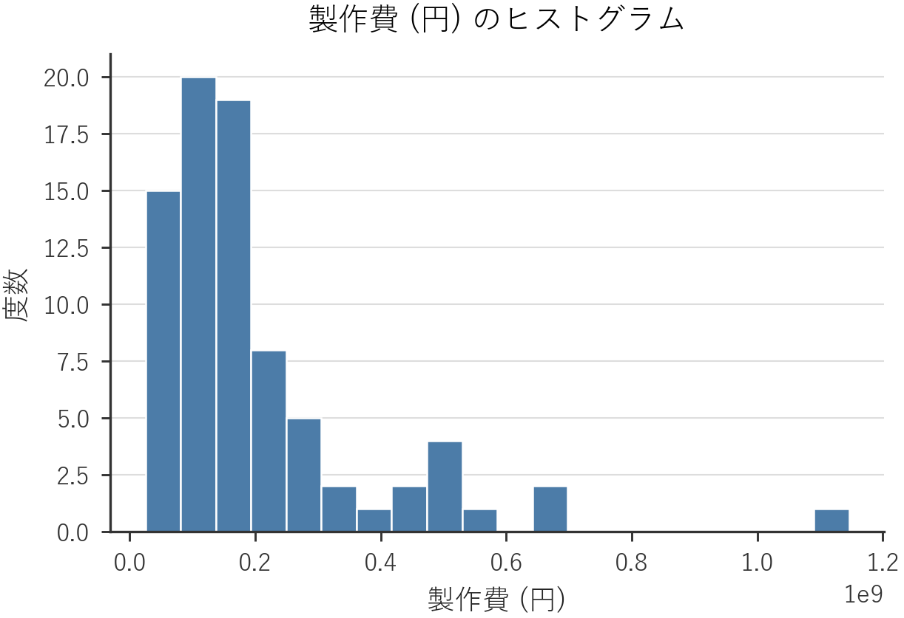
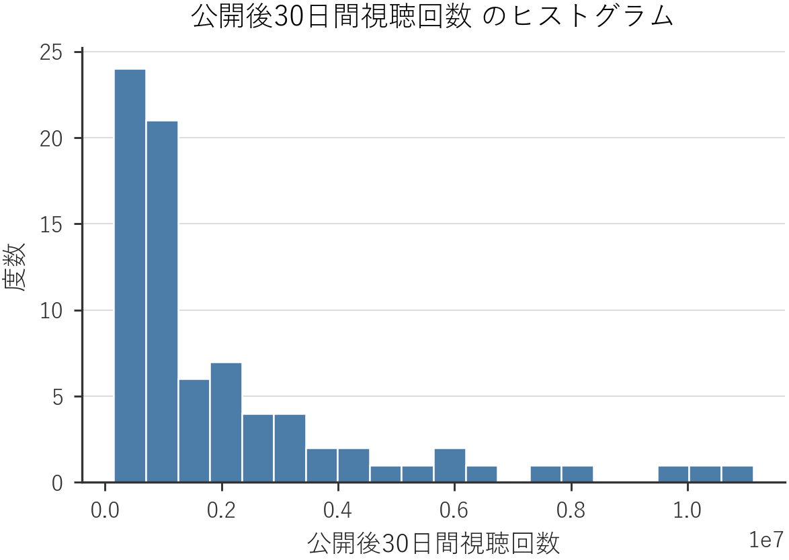
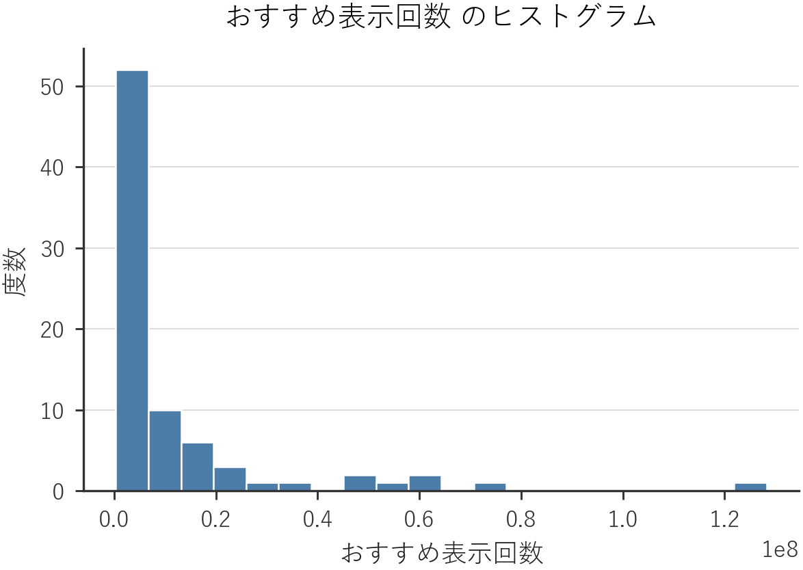
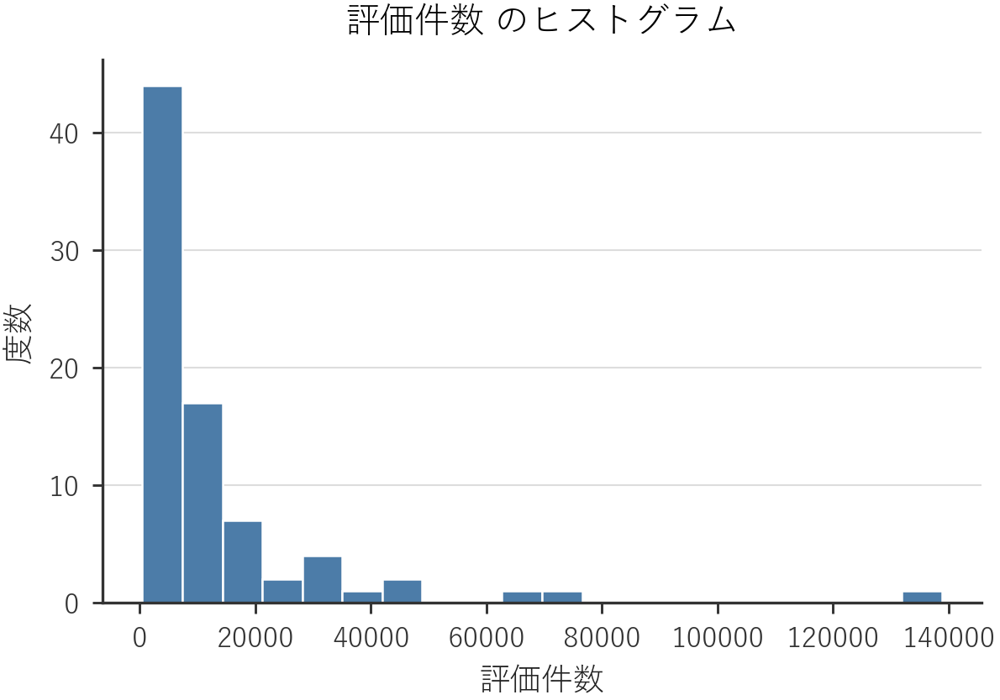
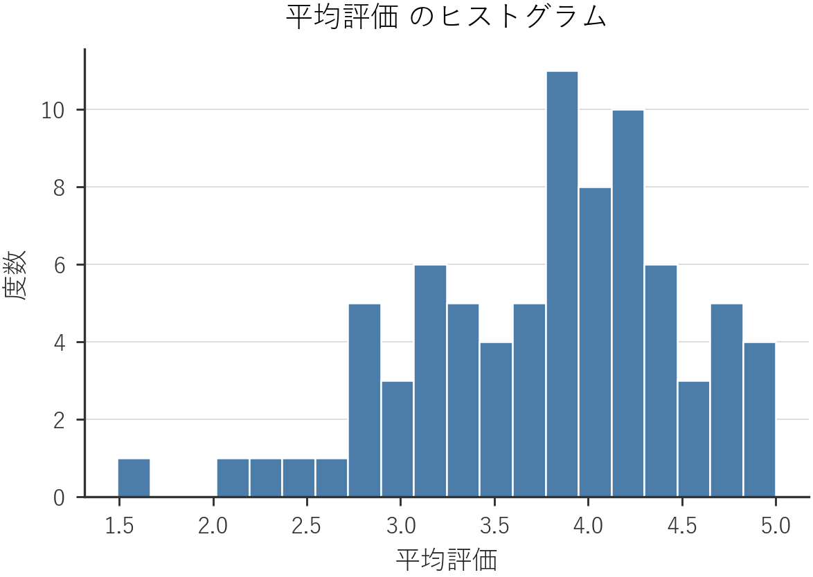
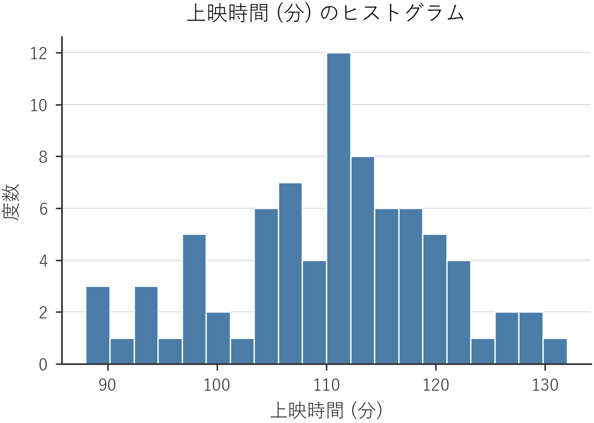
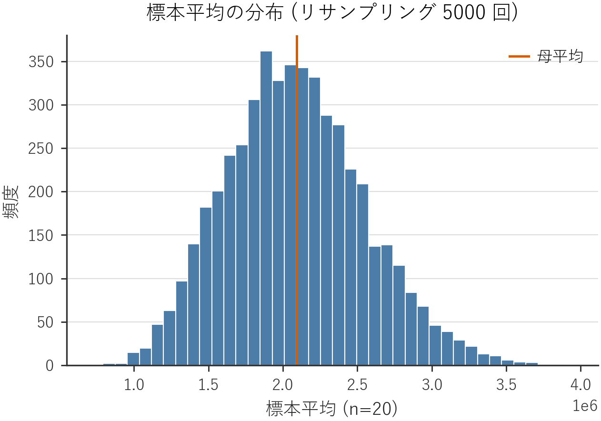
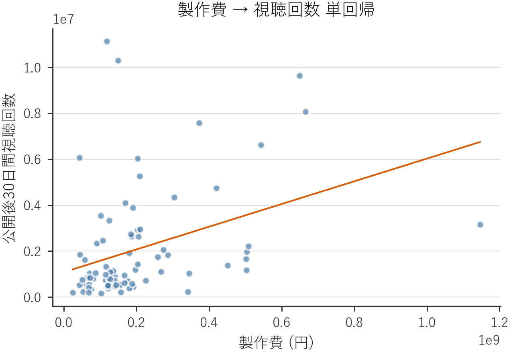

# ランニング例 検証レポート (最終版 / 確定: 2026-05-01, seed=42)

- 入力: `data/running_example.csv`
- 標本サイズ N: 80

## 1. 基本統計量

| 変数 | n | 平均 | 中央値 | 分散 | 標準偏差 | 最小 | 最大 |
|---|---:|---:|---:|---:|---:|---:|---:|
| 製作費 (円) | 80 | 204,313,058 | 152,810,145 | 31,615,530,463,512,228 | 177,807,566 | 24,877,764 | 1,146,171,243 |
| 公開後30日間視聴回数 | 80 | 2,093,859 | 1,070,844 | 5,797,741,652,834 | 2,407,850 | 152,605.0 | 11,126,834 |
| おすすめ表示回数 | 80 | 11,637,079 | 4,089,360 | 407,466,023,449,928 | 20,185,788 | 326,878.0 | 128,228,677 |
| 評価件数 | 80 | 12,634.8 | 5,756.0 | 396,477,073 | 19,911.7 | 438.0 | 138,801.0 |
| 平均評価 | 80 | 3.78 | 3.91 | 0.51 | 0.71 | 1.49 | 5.00 |
| 上映時間 (分) | 80 | 110.3 | 110.5 | 96.02 | 9.80 | 88.00 | 132.0 |

## 2. 質的変数の度数分布

**ジャンル**:
- ヒューマンドラマ: 22
- サスペンス: 18
- コメディ: 18
- 恋愛: 17
- アクション: 5

**原作の有無**:
- あり: 37
- なし: 43

## 3. ヒストグラム

### 製作費 (円)

### 公開後30日間視聴回数

### おすすめ表示回数

### 評価件数

### 平均評価

### 上映時間 (分)

## 4. 相関係数行列

| 変数 | 製作費 (円) | 公開後30日間視聴回数 | おすすめ表示回数 | 評価件数 | 平均評価 | 上映時間 (分) |
|---|---:|---:|---:|---:|---:|---:|
| 製作費 (円) | 1.000 | 0.365 | 0.218 | 0.188 | 0.090 | 0.057 |
| 公開後30日間視聴回数 | 0.365 | 1.000 | 0.803 | 0.706 | 0.206 | 0.022 |
| おすすめ表示回数 | 0.218 | 0.803 | 1.000 | 0.518 | 0.085 | -0.055 |
| 評価件数 | 0.188 | 0.706 | 0.518 | 1.000 | 0.201 | -0.003 |
| 平均評価 | 0.090 | 0.206 | 0.085 | 0.201 | 1.000 | -0.039 |
| 上映時間 (分) | 0.057 | 0.022 | -0.055 | -0.003 | -0.039 | 1.000 |

## 5. 章別演習シミュレーション

### 2章: 視聴回数の平均と中央値 (右への歪みの確認)

- 平均: 2,093,859
- 中央値: 1,070,844
- 平均 / 中央値 の比: 1.96
- 歪度 (skewness): 2.05

平均が中央値より明確に大きく, 右に歪んだ分布であることが確認できる.

### 4章: 標本平均の分布 (中心極限定理)

- リサンプリング: 5000 回, サンプルサイズ 20
- 母平均: 2,093,859
- 標本平均の平均: 2,085,783
- 標本平均の標準偏差 (実測): 463,794.0
- 理論的標準誤差 (σ/√n): 535,036.0
- 標本平均分布の歪度: 0.292
- 標本平均分布の尖度: -0.045

標本平均分布の歪度が元データに比べて大きく縮み, ほぼ正規分布に近い形となる
ことが確認できる (中心極限定理の確認).

### 5章: 母平均の95%区間推定

- 標本サイズ: 80
- 標本平均: 2,093,859
- 標準誤差: 269,205.8
- t 臨界値 (df=79, 両側 95%): 1.990
- 95%信頼区間: [1,558,019, 2,629,700]
- 区間幅 / 平均: 0.51

平均値の20-30%程度の幅で信頼区間が得られ, 教育的に扱いやすい区間幅である.

### 6章: 原作あり vs 原作なし の平均視聴回数 t検定

- 原作あり群: n=37, 平均=2,740,823, sd=2,606,365
- 原作なし群: n=43, 平均=1,537,170, sd=2,096,800
- 平均差 (あり - なし): 1,203,652
- Welch t統計量: 2.251
- p値: 0.0276
- Cohen's d: 0.509
- 判定: p < 0.05 (5%水準で有意)

### 7章: 主要な変数ペアの相関係数

| ペア | 相関係数 | 設計目安 | 範囲内? |
|---|---:|---|:---:|
| 製作費 vs 視聴回数 | +0.365 | 弱〜中 (0.3〜0.5) | OK |
| おすすめ表示回数 vs 視聴回数 | +0.803 | 中〜強 (0.6〜0.8) | NG |
| 平均評価 vs 視聴回数 | +0.206 | 弱 (0.1〜0.3) | OK |
| 評価件数 vs 視聴回数 | +0.706 | 中〜強 (0.6〜0.8) | OK |
| 上映時間 vs 視聴回数 | +0.022 | ほぼ無相関 | OK |

### 8章: 製作費 → 視聴回数 単回帰

- 切片: 1,084,095
- 傾き (1円当たり): 0.004942
- 傾き (1億円当たり): 494,224.0
- 決定係数 R²: 0.133
- 相関係数 r: +0.365
- 傾きの p値: 0.0009
- 傾きの標準誤差: 0.001428

傾きは正で, 決定係数は中程度. 単回帰の限界 (説明しきれない散らばり) が
散布図から読み取れる.

